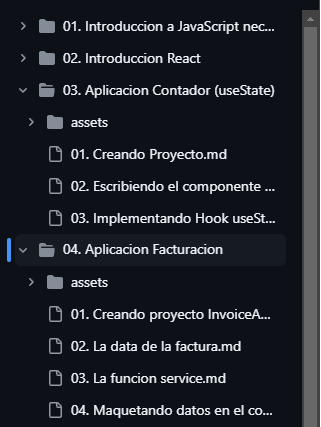

# MarkDown

Instala MarkText desde su [página web oficial](https://www.marktext.cc/) para escribir apuntes en formato markdown. A diferencia de Visual Studio Code, este editor es más ligero y permite escribir texto directamente en lugar de codigo.

## Sintaxis de markdown

Escribe código para introducir:

- Cualquier tipo: `@` 

- Encabezados: `# `, `## `, `### `.

- Texto en negrita: `**texto**`

- Texto en cursiva: `*texto*`

- Bloque de texto: `> texto`

- Lista ordenada: `1. texto`

- Lista no ordenada: `- texto`

- Linea horizontal: `---`

- Enlace: `[Markdown Cheat Sheet | Markdown Guide](https://www.markdownguide.org/cheat-sheet/)`

- Imagen: ``

- Fragmento de codigo: ````

- Bloque de código (funciona con cualquier lenguaje):

```html
<div>Codigo HTML</div>
```

```js
console.log("Codigo js")
```

Guia para trabajar con markdown: [https://www.markdownguide.org/](https://www.markdownguide.org/)

## Abrir una carpeta

1. Por defecto MarkText se mostrara en blanco, haz clic en el menú en la esquina superior izquierda, selecciona **File**, opción **Open Folder**.

2. Selecciona una carpeta, ten en cuenta que la carpeta seleccionada no debe contener subcarpetas para evitar problemas al almacenar una imagen. En la siguiente imagen se ha utilizado la carpeta `04. Aplicacion Facturación`.



**Nota**: Si no se muestra la imagen, coloca la imagen dentro de la carpeta `assets`, está carpeta debe permanecer en la misma carpeta donde se encuentra este archivo.

## Almacenamiento de imagenes

Las imagenes se introducen pulsando CTRL + V luego de haber realizado una captura de pantalla o copiar una imagen

1. Clic en el menú **File**, opción **Preferences**.

2. Selecciona la opción **Image**, marca **Prefer relative assets folder** para configurar una carpeta donde se almacenara las imagenes.

3. Escribele un nombre a la carpeta como por ejemplo "assets". Esta carpeta se creara al introducir una imagen.

**Nota**: Las imagenes que no se van a utilizar se quedaran almacenadas en la carpeta assets.
